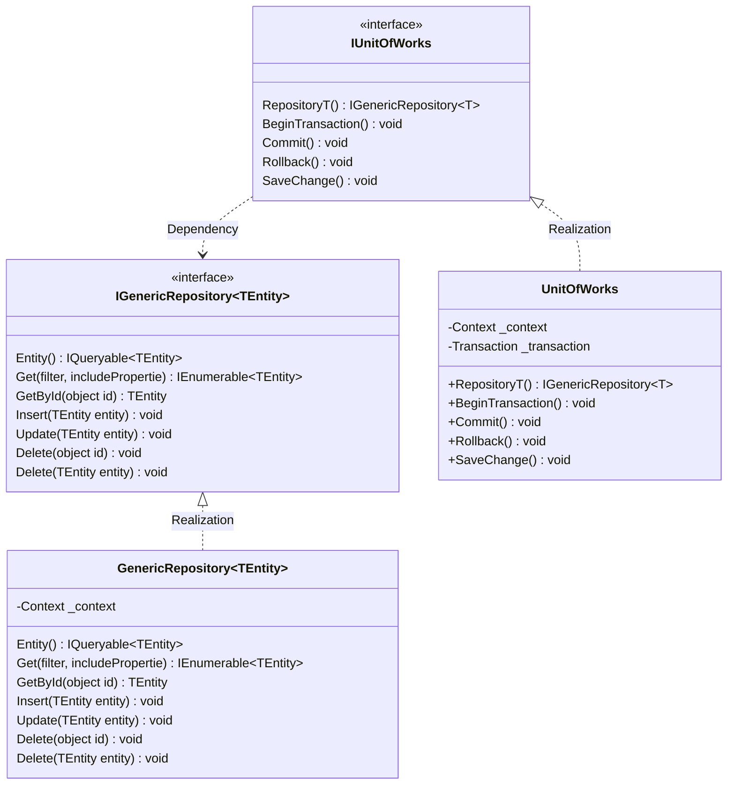
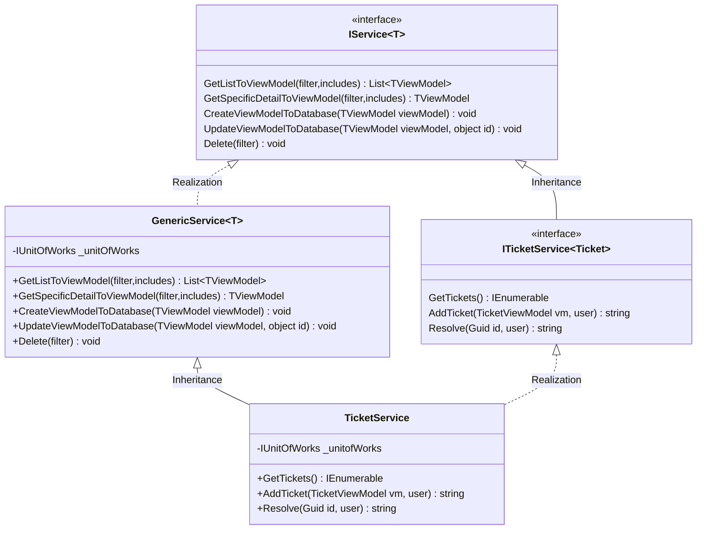

# TicketSystem

## Task 1

> Please write down all the use cases either in text or diagram you can think for Phase I and Phase II requirement separately.

Please see pdf document: `TicketSystem Task1 Flow.pdf` and `TicketSystem Task1 Swimlane.pdf`.

## Task 2

> Please implement the A. Phase I Requirement by .NET Core MVC/Java Spring MVC/PHP Laravel 8/ Python Django. For front-end, you can use any framework you like, but we prefer Vue XDD.

This project.

## Task 3

> Think of yourself as an architect. How will you design this system, please write down the design document at least to include data model, class diagram and UI mock up.

Please see pdf document: `TicketSystem Task3 Schema.pdf`

### class diagram

## Task 4

> If we are going to open the system for 3rd party to use, can you please design the Web API(Json format) and api document?
